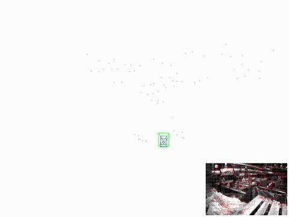

<!--
 * @Author: pengen.gao gaope.hb@gmail.com
 * @Date: 2025-08-31 02:06:34
 * Copyright (c) 2025 by gaope.hb@gmail.com, All Rights Reserved.
-->
# VerFlex-Vio: Versatile and Flexible Visual-Inertial Odometry System

A high-performance Visual Inertial Odometry (VIO) system implemented in C++ with ROS integration, featuring real-time state estimation using camera and IMU data.

## 🎬 Demo



Real-time Pangolin 3D viewer (EuRoC MH_01_easy): trajectory (red), current body pose (green frustum), active clone-window keyframes (blue frustums), MSCKF feature points (blue = in window, black = marginalized), and the live feature-tracking frame (inset). Built-in chase-cam follows the camera from behind; world Z points down to match the VIO frame. Enable with `enable_pangolin_viewer: true` (build with `-DUSE_PANGOLIN=ON`).

## 🚀 Features
- **Multiple camera models**: monocular and stereo camera models
- **Dual operation modes**: online/offline processing
- **Flexible initialization**: static/dynamic visual initialization
- **Multiple estimators**: support ESKF, Sqrt-ESKF solvers
- **Multiple frontends**: traditional KLT-based tracking & NN descriptor-based tracking
- **Threading options**: multi-threaded/single-threaded execution
- **Schmidt ESKF**: First clone pose anchoring to reduce trajectory drift
- **Numerically stable**: Joseph form covariance update for improved robustness
- **Dual feature support**: MSCKF features for batch updates & SLAM features for landmark-based updates
- **Sequential ESKF**: Sequential ESKF update for SLAM features to boost processing speed

## 🛠️ Installation

### Prerequisites

- **ROS Noetic** (Ubuntu 20.04)
- **CUDA 11.0+** (for neural feature extraction)
- **C++17** compatible compiler
- **CMake 3.15+**

### System Dependencies

```bash
# Install system dependencies
sudo apt update
sudo apt install -y \
    build-essential \
    cmake \
    git \
    libeigen3-dev \
    libopencv-dev \
    libgoogle-glog-dev \
    libgtest-dev \
    libceres-dev \
    libsophus-dev \
    python3-pip
```

### Building from Source

```bash
# Clone the repository
git clone git@github.com:qqqGpe/VerFlex-Vio.git
cd catkin_ws

# Quickly build the project with script
./src/VerFlex-Vio/script/build_vio_backend.sh

# Source the workspace
source devel/setup.bash
```

## 🚀 Quick Start

### 1. Basic Usage with Euroc Dataset

```bash
# Launch VIO with Euroc dataset with offline rosbag
roslaunch vio euroc_serial_backend.launch

# Launch VIO with Euroc dataset with rosbag playback
roslaunch vio euroc_serial_backend_subscribe.launch

# Launch VIO with Intel Realsense Camera
roslaunch vio realsense_serial_online.launch
```

### 2. Batch simulatation with Euroc dataset
```bash
# Batch simulation and evaluation
source ./devel/setup.zsh

# Run all data
python3 src/vio_backend/script/run_vio_batch.py --align --dataset_dir ~/dataset/euroc_mav --cases all

# Run specified data
python3 src/vio_backend/script/run_vio_batch.py --align --dataset_dir ~/dataset/euroc_mav --cases MH_01_easy

# An example of running results for batch simulation on EuRoC dataset (APE, SE(3)-aligned)
# Config: sqrt-root ESKF solver (solver_type=1) + rotation-compensated warp KLT (frontend) +
# projected adaptive Mahalanobis chi-square gate (backend). All 9 sequences run to completion
# (0 crashes). MH_05_difficult (which diverged with the eskf solver, 147 m) is now 4.10 m.
# V1_02_medium was 2.65 m before the warp fix and is now 0.285 m.
# ================================================================================
# VIO SIMULATION RESULTS SUMMARY (APE, SE(3)-aligned, meters)
# ================================================================================
# +----------------+-----------+-----------+-----------+-----------+-----------+-----------+-----------+
# | Dataset        |      RMSE |      Mean |    Median |       Std |       Min |       Max |       SSE |
# +================+===========+===========+===========+===========+===========+===========+===========+
# | MH_01_easy     |  0.0643   |  0.0563   |  0.0453   |  0.0310   |  0.0137   |  0.1882   |    15.02  |
# +----------------+-----------+-----------+-----------+-----------+-----------+-----------+-----------+
# | MH_02_easy     |  0.1113   |  0.0966   |  0.0769   |  0.0552   |  0.0327   |  0.2375   |    37.09  |
# +----------------+-----------+-----------+-----------+-----------+-----------+-----------+-----------+
# | MH_03_medium   |  0.1676   |  0.1567   |  0.1625   |  0.0595   |  0.0045   |  0.3058   |    73.10  |
# +----------------+-----------+-----------+-----------+-----------+-----------+-----------+-----------+
# | MH_04_difficult|  0.5742   |  0.4761   |  0.4688   |  0.3210   |  0.0818   |  2.6276   |   574.95  |
# +----------------+-----------+-----------+-----------+-----------+-----------+-----------+-----------+
# | MH_05_difficult|  4.0986   |  2.9177   |  1.8461   |  2.8784   |  0.9302   | 12.3558   | 27700.50  |
# +----------------+-----------+-----------+-----------+-----------+-----------+-----------+-----------+
# | V1_01_easy     |  0.0955   |  0.0820   |  0.0724   |  0.0489   |  0.0031   |  0.6124   |    25.80  |
# +----------------+-----------+-----------+-----------+-----------+-----------+-----------+-----------+
# | V1_02_medium   |  0.2845   |  0.1507   |  0.1180   |  0.2413   |  0.0236   |  3.2869   |   125.79  |
# +----------------+-----------+-----------+-----------+-----------+-----------+-----------+-----------+
# | V2_01_easy     |  0.0712   |  0.0606   |  0.0557   |  0.0375   |  0.0010   |  0.5665   |    11.23  |
# +----------------+-----------+-----------+-----------+-----------+-----------+-----------+-----------+
# | V2_02_medium   |  0.0937   |  0.0826   |  0.0786   |  0.0442   |  0.0178   |  0.5715   |    19.92  |
# +----------------+-----------+-----------+-----------+-----------+-----------+-----------+-----------+
```

**Note**: This is a research-grade VIO system. For production use, additional testing and validation is recommended.
